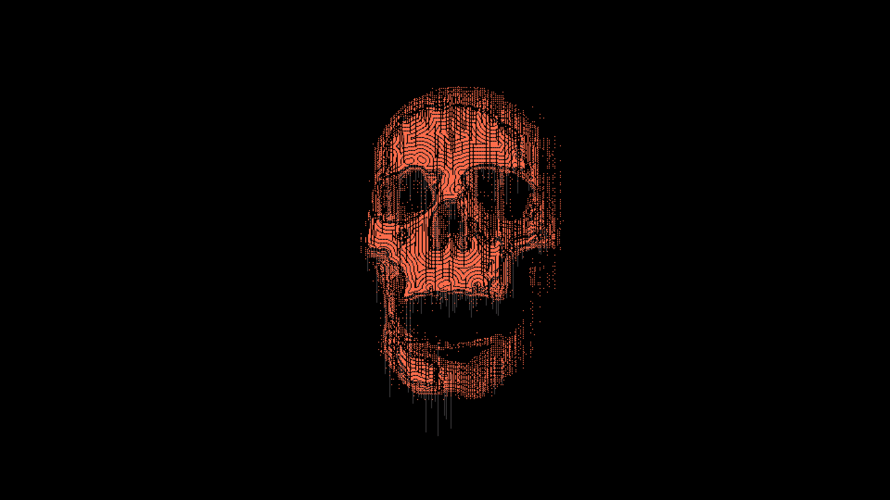
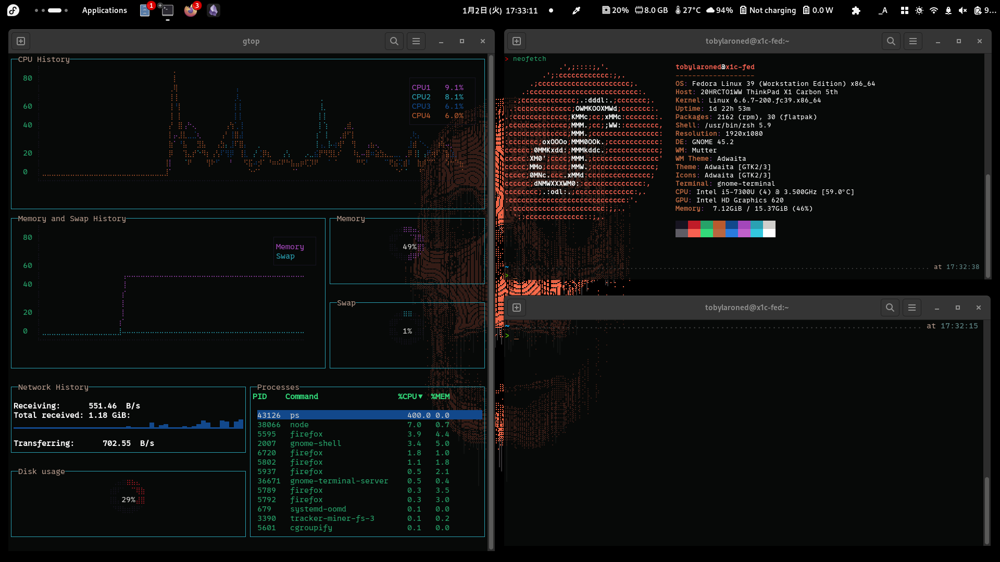
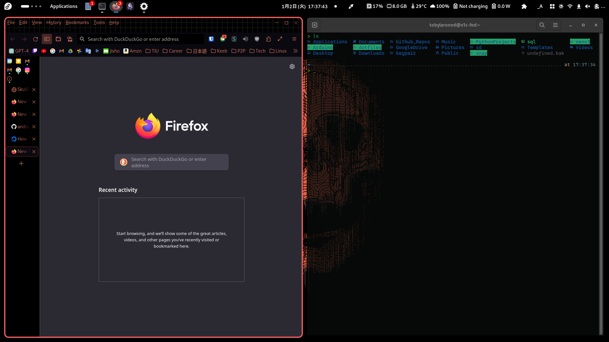
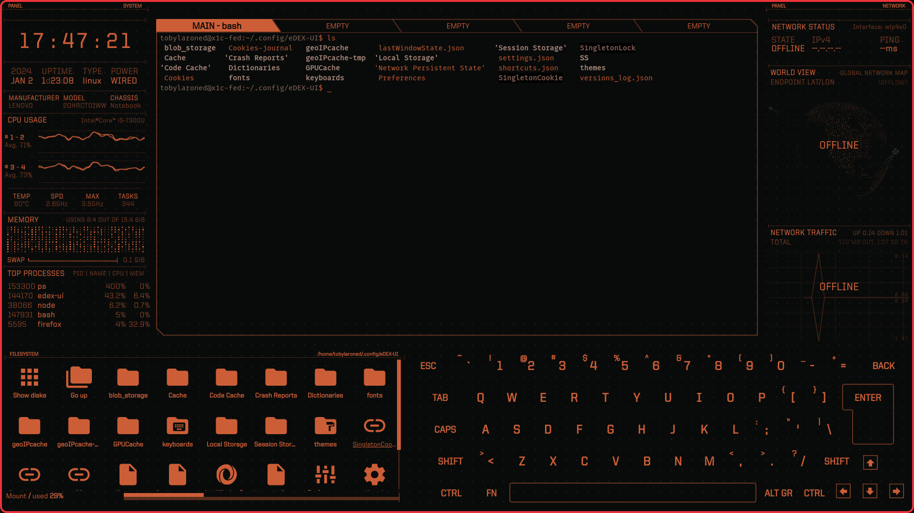

# Tob-Linux Rice/Theme

My personal Linux setup configs, including GNOME settings, custom keyboard layouts, and various dotfiles. Does this count as a rice already? Whatever, I like it so far. Might consider trying out SWAY in the future.

Though I still main Fedora on my Thinkpad, I'm actually using PopOS on my desktop PC right now. All modifications etc. on there are based on this rice though. 

## Screenshots

### Current Wallpaper


### Desktop using [Forge TWM](https://github.com/forge-ext/forge)

Note: Forge is a tiling window manager-like extension for Gnome.

### Firefox Theme

Notice the left-hand side tabs list and the lack of tabs on the top.

Note: The orange ring surrounding firefox you see is the "selected window" indicator from Forge TWM extension mentioned earlier.


### Colors are based on an [Edex-UI Theme](https://github.com/GitSquared/edex-ui/blob/master/media/screenshot_blade.png)


## Contents

- `gnome-settings`: GNOME settings and extensions.
- `input-remapper-2`: Custom keyboard layouts and Input Remapper configurations.
- `scripts`: Installation and setup scripts.
- Dotfiles like `.p10k.zsh` : Configuration files for Zsh, Vim, and Powerlevel10k.

## Installation (WIP/作業中)

1. **Clone the Repository**:
   ```bash
   git clone https://github.com/andra-putra/tob-fedorahttps://github.com/andra-putra/tob-fedora
   cd tob-fedora
    ```

### Firefox Setup
My firefox modifications are made to use the [Tree Style Tab](https://addons.mozilla.org/en-US/firefox/addon/tree-style-tab/) extension with thinner bezels on the sides and top, along with changing the minimum width of the left-hand side tabs list. 
These modifications are done by using a `userChrome.css` file in firefox.

1. To use the `userChrome.css` file, you must first set these following things to `true` in firefox's `about:config`: `toolkit.legacyUserProfileCustomizations.stylesheets` and `devtools.chrome.enabled`
2. Then, locate your user profile folder by going to `about:support` and clicking on `Profile Directory` --> `Open Directory` 
3. Inside your profile folder, locate or create `chrome` folder
4. Place the [userChrome.css](./firefox/userChrome.css) file from this repo into that `chrome` folder

I also use a [custom firefox color theme](https://color.firefox.com/?theme=XQAAAAIgAQAAAAAAAABBqYhm849SCia2CaaEGccwS-xMDPryguaG23ZQLclaabCRGMSkdTEdxh6UXQSr56S8jn27vOFOSm7G-dmiCy1yl7h3M1feQdaYABC8iXqLydFJlD5_8Jz0Vnm5WkxA8Rff-3q97iBIGR3_njstPDQm0ceaOfZKfQf8TDoF4hvwlRB-pYVIFz7jUf1AF6d4pXtmC20ZJoPHDEeDDOp-Ufu1H67btL_KM2zjv-2QXaFxqL4Hs_6ozWA) using Firefox Color.

### Terminal Modifications
Uses:
- Default gnome-terminal

Will look into other things like kitty etc. in the future.

### Shell Modifications
Uses:
- Oh-my-zsh, p10k theme

Extensions enabled:
- [FZF-zsh-plugin](https://github.com/unixorn/fzf-zsh-plugin)
- [zsh-autosuggestions](https://github.com/zsh-users/zsh-autosuggestions)
- [zsh-syntax-highlighting](https://github.com/zsh-users/zsh-syntax-highlighting)

### Text Editor
Uses:
- [Neovim](https://neovim.io/) + [NvChad](https://github.com/NvChad/NvChad)

### Japanese IME
Uses:
- [Ibus-Anthy](https://github.com/ibus/ibus-anthy/)
    - Fedora comes with this as default JP input out of the box, but in case it doesn't, I followed [this guide](https://yasuhira-tanuki.com/linux-ibus-anthy/) for my PopOS install.

Keyboard shortcuts (rest is default other than these three):
| Command   | Shortcut    |
|--------------- | --------------- |
| on_off   | alt+grave   |
| hiragana_mode   | alt+caps_lock   |
| katakana_mode   | shift+caps_lock   |


### Gnome extensions
Currently have to be installed manually through the [Gnome Extensions website](https://extensions.gnome.org)
- App icons taskbar
- Color picker
- Custom accent colors
- Extensions list
- Forge
- Logo menu
- User Themes
- Vitals
- Privacy quick settings
- Quick settings audio panel
- QSTweak Quick Setting Tweaker
- Top panel notification icons revived
- Adjust Display Brightness
- Top Bar Organizer
- [AlphaTint](https://extensions.gnome.org/extension/4624/alphatint/)
- [Mouse Follows Focus](https://extensions.gnome.org/extension/4642/mouse-follows-focus/)    

Additional PopOS Specific Extensions:
- Audio Selector
- Dotspaces 
- Top Panel Workspace Scroll

### Google Drive Integration
Though distros like Fedora have built-in cloud storage integration through Gnome Accounts or whatever, I found that it doesn't play well with things like Obsidian that live-edits the files.

I found that using rclone worked much better for that purpose, so I decided to use that mainly. Though this does come with the downside of seeing double cloud storage locations sometimes on Fedora.

Uses:
- [rclone](https://github.com/rclone/rclone)
    - My rclone setup can be found [here](./other_files/rclone_configs/) 

### Enabling Hibernate for Laptops
Followed [this guide](https://fedoramagazine.org/hibernation-in-fedora-36-workstation/) to enable hibernate first.

Some issues with wifi adapter not working after hibernation, followed [this guide](https://community.frame.work/t/guide-solution-for-wifi-problems-after-hibernate-non-systemd/52332). You can find my personal file to fix this issue in this repo at `./other_files/hibernate-pre-post.sh`

## TODO
- Export `gnome-terminal` config colors, etc.
- Look into using alternate terminal emulator (something simple + tmux maybe?)
- Firefox: link chrome.css to other repo
