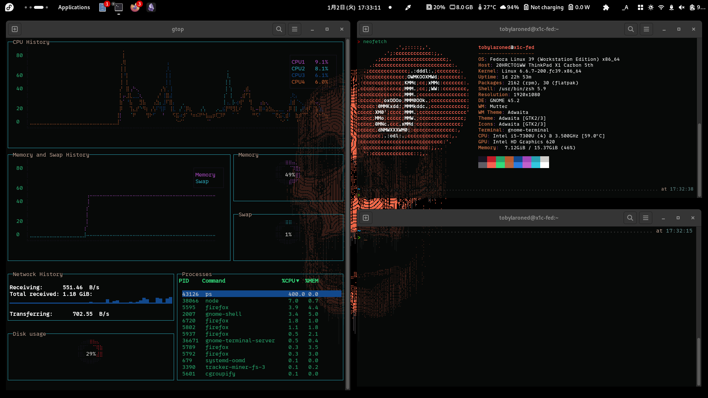

# Fedora Copland Rice/Theme

This repository contains my personal Fedora setup configurations, including GNOME settings, custom keyboard layouts, and various dotfiles. 


## Contents

- `gnome-settings`: GNOME settings and extensions.
- `input-remapper-2`: Custom keyboard layouts and Input Remapper configurations.
- `scripts`: Installation and setup scripts.
- Dotfiles like `.p10k.zsh` : Configuration files for Zsh, Vim, and Powerlevel10k.

## Installation

1. **Clone the Repository**:
   ```bash
   git clone https://github.com/andra-putra/fedora-copland.git
   cd fedora-copland


## Gnome extensions
Currently have to be installed manually through the [Gnome Extensions website](https://extensions.gnome.org)
- App icons taskbar
- Color picker
- Custom accent colors
- Extensions list
- Forge
- Logo menu
- User Themes
- Vitals
